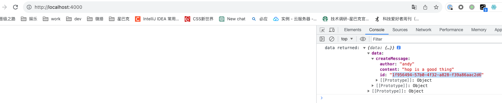
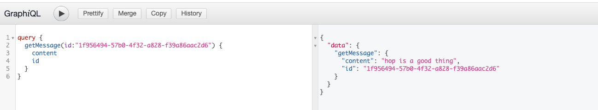

# graphql-learn

To install dependencies:

```bash
bun install
```

To run:

```bash
bun run serve
```

This project was created using `bun init` in bun v1.0.1. [Bun](https://bun.sh) is a fast all-in-one JavaScript runtime.





